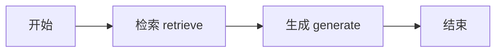
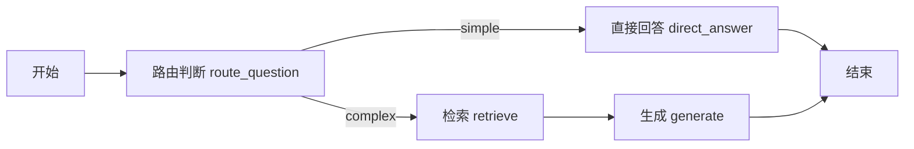
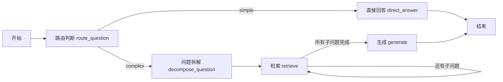

# 从死板检索到智能推理：Agentic RAG 如何让大模型真正「读懂」你的知识库

> **核心结论：** 传统 RAG 是一条固定流水线——所有问题一视同仁地检索、生成，既浪费资源又无法处理复杂推理。Agentic RAG 通过引入「路由判断 → 问题拆解 → 多轮检索 → 评估纠错」的智能闭环，让 RAG 从机械执行升级为可思考、可判断、可纠错的智能架构。

---

## 一、为什么公司内部 Agent 都离不开 RAG？

大模型（LLM）具备强大的语言理解和推理能力，但它有一个致命盲区：**它不知道你公司的内部文档**。

当用户问「我们产品的退货政策是什么？」或「项目 X 的技术方案细节」时，LLM 只能靠训练数据中的通用知识回答，大概率胡说八道。RAG（Retrieval-Augmented Generation，检索增强生成）的核心思路就是：

```
用户提问 → 从内部知识库检索相关文档 → 把文档喂给 LLM → LLM 基于文档生成回答
```

这个方案解决了 LLM「知识盲区」的问题，因此几乎所有企业级 Agent 项目都会用到 RAG。但问题在于——**大多数 RAG 实现都太死板了**。

---

## 二、传统 RAG 的五大致命缺陷

### 缺陷一：所有问题一视同仁，简单问题也走检索——浪费资源

用户问「1+1 等于几？」，传统 RAG 也会老老实实地去向量数据库检索一遍，再把检索结果和问题一起丢给 LLM 生成回答。

这就像你去问同事一个常识问题，他非要先翻遍公司所有文档再回答你——**完全没必要**。

**浪费的不只是算力，还有时间。** 每次检索都意味着额外的向量计算、网络请求、token 消耗。当 QPS 上升时，这种浪费会成倍放大。

### 缺陷二：没有纠错和评估机制——检索结果好不好，全靠运气

传统 RAG 检索完就直接生成，**从不回头检查**：

- 检索到的文档真的和问题相关吗？不知道。
- 检索到的内容足够回答这个问题吗？不知道。
- 检索结果之间有矛盾怎么办？不知道。

LLM 会在「看似相关但实际跑偏」的文档上一本正经地胡说八道，而且说得头头是道，用户根本分辨不出来。

### 缺陷三：处理不了多步推理的复杂问题

看这个例子：

> 「天龙八部中四大恶人排行第二的是谁？此人之子在身世揭晓前，其生父在武林中的公开身份是什么？」

这个问题需要**两步推理**：
1. 先查「四大恶人排行第二是谁」→ 段延庆
2. 再查「段誉（段延庆之子）的生父在武林中的公开身份」→ 段正淳（大理镇南王）

传统 RAG 只做一次检索，根本无法处理这种**链式推理**问题。它要么只回答第一问，要么把两个问题混在一起检索，结果一团糟。

### 缺陷四：纯语义检索对专业术语和精确实体匹配不准

向量检索的原理是计算语义相似度，但语义相近 ≠ 意思相同：

- 「高血糖」和「低血糖」在向量空间中距离很近（语义相似度高），但它们是**完全不同的疾病**。
- 用户搜「MySQL 的 `LIKE` 语法」，纯语义检索可能返回「MySQL 的模糊查询」——看着像，但不精确。

专业术语、精确实体、代码函数名这类内容，**关键词精确匹配**（如正则、SQL LIKE）比语义检索靠谱得多。

### 缺陷五：本地知识库没有的内容，LLM 直接胡说

当用户问的问题在知识库中找不到答案时，传统 RAG 要么返回「未找到相关内容」（体验差），要么 LM 基于不相关的上下文强行编造答案（更危险）。

理想的方案是：**当本地知识库无法回答时，自动切换到网络搜索补充信息。**

---

## 三、Agentic RAG：让 RAG 具备「思考」能力

Agentic RAG 的核心思想是：**把死板的检索-生成流水线，升级为可思考、可判断、可纠错的智能架构。**

传统 RAG 像一条流水线：输入 → 检索 → 生成 → 输出，中间没有任何判断和调整。Agentic RAG 则引入了一个「智能调度员」，在每个环节做决策：

```
用户提问
  ↓
┌─────────────────────────────┐
│  LLM 路由判断                │
│  这个问题需要检索吗？         │
│  需要几步检索？               │
│  该用语义检索还是关键词检索？   │
└─────────────────────────────┘
  ↓                ↓            ↓
直接回答         单轮检索      多轮检索
  ↓                ↓            ↓
              LLM 评估检索质量
              不够？重新检索
              够了？生成回答
```

具体来说，Agentic RAG 在传统 RAG 基础上增加了四个关键能力：

| 能力 | 传统 RAG | Agentic RAG |
|------|---------|-------------|
| 问题路由 | 所有问题走同一条路 | LLM 判断简单/复杂，走不同分支 |
| 问题拆解 | 不支持 | 复杂问题拆成有序子问题 |
| 多轮检索 | 单次检索 | 按子问题依次检索，结果去重合并 |
| 检索评估 | 无 | 可扩展评估检索质量 |

---

## 四、实战：用 LangGraph 构建三阶段进化 RAG

我们通过三个阶段，逐步展示从传统 RAG 到 Agentic RAG 的演进过程。所有代码基于 LangGraph 框架，使用 Milvus 向量数据库存储《天龙八部》小说文本。

### 阶段一：Naive RAG —— 最基础的检索-生成流水线

Naive RAG 是最简单的实现，只有两个节点：**检索** 和 **生成**。



**代码实现核心：**

```javascript
// 状态定义：只有 question、k、documents、generation 四个字段
const GraphState = Annotation.Root({
  question: Annotation,   // 用户问题
  k: Annotation,          // 检索数量
  documents: Annotation,  // 检索到的文档
  generation: Annotation  // 生成的内容
});

// 图构建：极其简单，START → retrieve → generate → END
const graph = new StateGraph(GraphState)
  .addNode("retrieve", retrieveNode)
  .addNode("generate", generateNode)
  .addEdge(START, "retrieve")
  .addEdge("retrieve", "generate")
  .addEdge("generate", END)
  .compile();
```

**检索函数**直接调用 Milvus 的相似度搜索，返回带分数的文档列表：

```javascript
async function retrieveRelevantContent(question, k = TOP_K) {
  const docsWithScores = await vectorStore.similaritySearchWithScore(question, k);
  return docsWithScores.map(([doc, score]) => ({
    score,
    content: doc.pageContent,
    id: doc.metadata?.id ?? "unknown",
    chapter_num: doc.metadata?.chapter_num ?? "未知",
  }));
}
```

**问题：** 无论用户问什么，都会走一遍检索。问「1+1=?」也要检索，浪费资源。

---

### 阶段二：Query Router —— 让 LLM 判断问题复杂度

在 Naive RAG 的基础上，增加一个 **路由节点**：让 LLM 先判断问题是「简单问题」还是「复杂问题」，走不同的处理分支。



**关键设计：结构化输出 + 条件路由**

路由节点使用 Zod Schema 约束 LLM 的输出，确保得到结构化的判断结果：

```javascript
// 定义路由输出的 Schema
const RouteSchema = z.object({
  strategy: z.enum(["simple", "complex"]),  // 二分类
  reason: z.string()                         // 判断理由
});

const routeQuestionNode = async (state) => {
  const router = model.withStructuredOutput(RouteSchema);
  const route = await router.invoke(`
    你是问答路由器，请判断用户问题是否需要外部检索。
    规则：
    - simple: 常识问答、简短定义、无需特定细节即可回答。
    - complex: 需要具体情节、人物关系、章节事实或证据支持。
    用户问题： ${state.question}
  `);
  return { strategy: route.strategy, routeReason: route.reason }
}
```

**条件边**根据路由结果选择不同分支：

```javascript
const decideNext = (state) =>
  state.strategy === 'simple' ? "direct_answer" : "decompose_question";
```

**效果：** 问「1+1=?」→ LLM 判断为 simple → 直接回答，跳过检索。问「阿朱是怎么死的？」→ 判断为 complex → 走检索流程。节省了大量不必要的 token 和时间。

---

### 阶段三：Multi-Hop RAG —— 多步推理，拆解复杂问题

这是 Agentic RAG 的完整形态。在 Query Router 的基础上，增加了 **问题拆解** 和 **多轮检索** 能力。



**核心：问题拆解器（Decompose）**

将复杂问题拆成有序的子问题列表，每个子问题可独立检索：

```javascript
const DecomposeSchema = z.object({
  sub_questions: z.array(z.string()).min(1).max(8),
  reason: z.string()
});

const decomposeQuestionNode = async (state) => {
  const decomposer = model.withStructuredOutput(DecomposeSchema);
  const out = await decomposer.invoke(`
    你是《天龙八部》多跳问答的【子问题拆解器】。
    用户原始问题：${state.question}
    任务：将问题拆成有序子问题列表，用于依次向量检索。
    要求：
    1. 链式推理、多层关系的问题，必须拆成多条
    2. 每条子问题必须是可独立检索的完整问句，禁止使用指代词
    3. 顺序必须符合推理链：先查前置事实，再查后续结论
    4. 输出 1～8 条即可
  `);
  return {
    subQuestions: out.sub_questions.map(s => s.trim()).filter(Boolean),
    nextSubIdx: 0,
    currentQuery: out.sub_questions[0],
  }
}
```

**多轮检索 + 结果去重**

每轮检索一个子问题的结果，然后与已有文档合并去重，避免重复内容：

```javascript
const mergeUnique = (existingDocs, newDocs) => {
  const map = new Map();
  for (const d of [...existingDocs, ...newDocs]) {
    const key = String(d.id);
    const prev = map.get(key);
    if (!prev || Number(d.score) > Number(prev.score)) {
      map.set(key, d);  // 保留分数更高的版本
    }
  }
  return [...map.values()];
}
```

**实际效果演示：**

用户问：「阿朱是怎么死的？那个时候虚竹怎么了？」

1. **路由判断** → complex（需要小说细节）
2. **问题拆解** →
   - 子问题 1：「阿朱是怎么死的？」
   - 子问题 2：「虚竹在阿朱死亡时发生了什么事？」
3. **第 1 轮检索**：查子问题 1 → 找到相关章节
4. **第 2 轮检索**：查子问题 2 → 找到相关章节，与第 1 轮结果合并去重
5. **生成回答**：综合所有检索结果，给出完整答案

---

## 五、StateGraph 状态设计：Agentic RAG 的数据中枢

Agentic RAG 的状态定义比 Naive RAG 复杂得多，需要承载路由决策、问题拆解、多轮检索等所有中间状态：

```javascript
const GraphState = Annotation.Root({
  question: Annotation,          // 原始用户问题
  k: Annotation,                 // 每轮检索数量
  strategy: Annotation,          // 路由策略：simple / complex
  routeReason: Annotation,       // 路由判断的理由
  subQuestions: Annotation,      // 拆解后的子问题列表
  nextSubIdx: Annotation,        // 当前正在处理的子问题索引
  currentQuery: Annotation,      // 当前正在检索的子问题
  retrievalCount: Annotation,    // 已执行的检索轮次
  maxRetrievalCount: Annotation, // 最大检索轮次（防止无限循环）
  planedNext: Annotation,        // 计划的下一步
  documents: Annotation,         // 累计检索到的文档（去重后）
  generation: Annotation         // 最终生成的回答
});
```

每个字段都有明确的职责，状态在节点之间流转，每个节点只读写自己关心的字段。这是 LangGraph 的核心设计哲学——**通过显式状态管理实现节点间的解耦**。

---

## 六、关键设计决策与经验总结

### 1. 为什么用 Zod Schema 做结构化输出？

LLM 的原始输出是自由文本，直接解析容易出错。通过 `model.withStructuredOutput(Schema)` 约束输出格式，可以确保：
- 路由结果一定是 `simple` 或 `complex`
- 子问题列表一定是字符串数组
- 不会出现格式解析失败

### 2. 为什么需要结果去重？

多轮检索中，不同子问题可能命中同一篇文档。不去重会导致：
- 相同内容重复出现在 prompt 中，浪费 token
- LLM 可能基于重复内容给出偏颇的回答

`mergeUnique` 函数用文档 ID 做 key，保留分数最高的版本，既去重又保证质量。

### 3. 为什么限制最大检索轮次？

`maxRetrievalCount` 是一个安全阀。极端情况下，子问题拆解可能产生较多子问题，如果不加限制，检索轮次过多会导致：
- 响应时间过长
- token 消耗爆炸
- 检索到的文档太多，超出 LLM 上下文窗口

### 4. 未来可扩展的方向

- **检索评估节点**：在检索后增加 LLM 评估，判断检索质量是否足够，不够则重新检索或调整查询
- **混合检索**：对专业术语自动切换为关键词检索（SQL LIKE / 正则），提高精确匹配能力
- **网络搜索补充**：当本地知识库无法回答时，自动调用搜索引擎补充信息
- **自我纠错循环**：生成回答后，LLM 自我检查是否有事实错误，有则重新检索

---

## 七、总结：从「死板流水线」到「智能体」

| 演进阶段 | 核心特征 | 解决的问题 |
|---------|---------|-----------|
| Naive RAG | 检索 → 生成，固定流程 | LLM 不知道内部文档 |
| Query Router | LLM 判断问题复杂度，走不同分支 | 简单问题浪费资源 |
| Multi-Hop RAG | 问题拆解 + 多轮检索 + 结果去重 | 复杂多步推理问题 |
| Agentic RAG（完整） | + 检索评估 + 自我纠错 + 混合检索 | 检索质量不可控、专业术语匹配不准 |

**核心思想只有一个：让 LLM 从「被动执行」变成「主动思考」。**

传统 RAG 中，LLM 只在最后一步出场——拿到检索结果，生成回答。而在 Agentic RAG 中，LLM 贯穿全流程：判断问题类型、拆解子问题、评估检索质量、生成回答、甚至自我纠错。

这正是「Agentic」的含义——**不是执行固定流程的工具，而是具备自主决策能力的智能体。**

---

*本文代码基于 LangGraph + Milvus + OpenAI Embeddings 实现，完整项目结构见仓库。*
