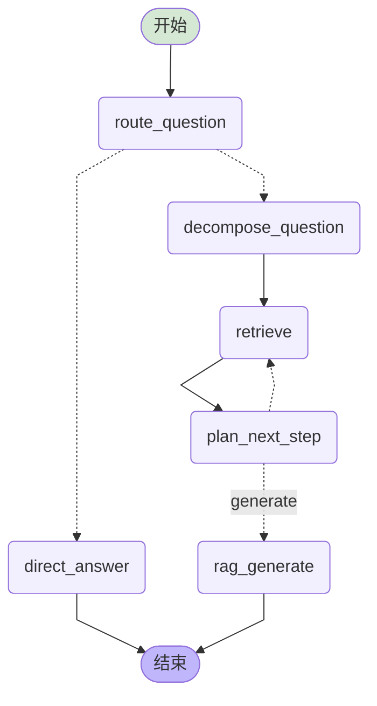

```mermaid
%%{init: {'flowchart': {'curve': 'linear'}}}%%
graph TD;
    start([开始]):::first
    route_question(route_question)
    direct_answer(direct_answer)
    decompose_question(decompose_question)
    retrieve(retrieve)
    plan_next_step(plan_next_step)
    rag_generate(rag_generate)
    finish([结束]):::last
    start --> route_question;
    decompose_question --> retrieve;
    direct_answer --> finish;
    rag_generate --> finish;
    retrieve --> plan_next_step;
    route_question -.-> direct_answer;
    route_question -.-> decompose_question;
    plan_next_step -.-> retrieve;
    plan_next_step -. generate .-> rag_generate;
    classDef default fill:#f2f0ff,line-height:1.2;
    classDef first fill:#d5e8d4;
    classDef last fill:#bfb6fc;
```
