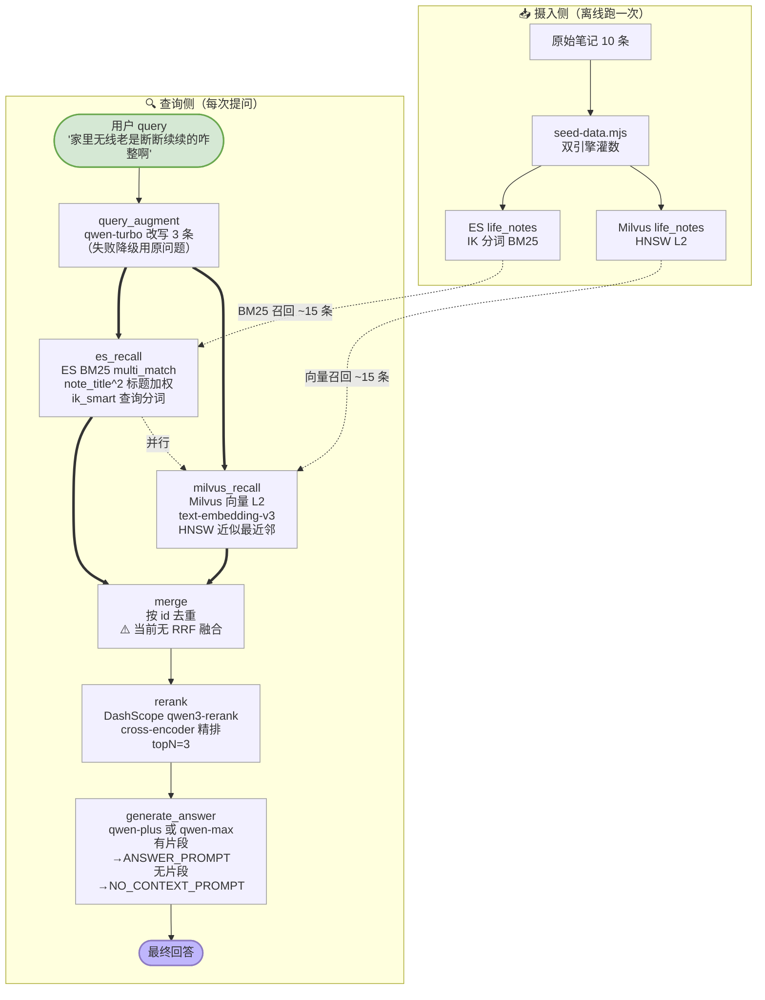
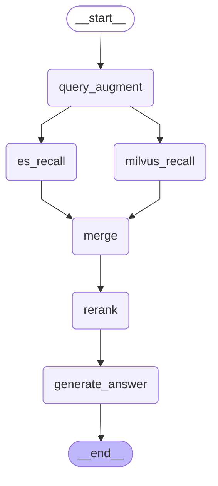

# 混合检索三级方案（hybrid-retrieval.mjs）

> 本图是 b.md 中 `query_augment → retrieve` 路径的**展开细节**。
> b.md 画的是 Agentic RAG 全架构（路由/多跳/联网兜底），本图专注"混合检索三级方案"这一条查询引擎管线。

## 查询侧流程



## 关键设计点

### 三级方案（从粗到精）

| 级别 | 节点 | 数量 | 作用 |
|---|---|---|---|
| L1 召回 | es_recall + milvus_recall | 各 ~15 条 | 两路并行，广撒网 |
| L2 融合 | merge | 去重后 ~20-25 条 | 双路互补，目前只去重无 RRF |
| L3 精排 | rerank | Top-3 | cross-encoder 按 query 语义精排 |

### 为什么双路能互补

| 场景 | BM25 赢 | 向量赢 |
|---|---|---|
| "SN-MILO-77821 怎么换滤芯" | ✅ 精确匹配序列号 | ❌ 专有名词向量模糊 |
| "汤不好喝怎么办" | ❌ 关键词不重合 | ✅ 语义命中"肉汤熬久了反而涩" |
| "断流" vs "网速玄学" | 各自命中部分 | 可能都能命中 |

### 各环节模型选择

| 环节 | 模型 | 理由 |
|---|---|---|
| query_augment | qwen-turbo | 中间环节，改写够用就行，省钱 |
| rerank | qwen3-rerank | 专用 cross-encoder，唯一能做精排的模型 |
| generate_answer | qwen-plus/max | 面向用户，需要精确引用 + 自然语言 |

### 失败降级

- query_augment 失败 → 三条改写全用原始问题，检索照跑
- rerank 关掉 → merge 直接进 generate_answer，效果差但不崩

## 和 b.md 的关系

```
b.md（Agentic RAG 全架构）
├─ route_question → simple/direct_answer
├─ route_question → web/联网兜底
└─ route_question → complex
     └─ decompose_question → query_augment
          └─ retrieve  ←───────── 本图（c.md）就是这行的展开
               ├─ 双路召回（BM25 + 向量）
               ├─ 融合 + RRF
               └─ cross-encoder 精排
```

简单说：**b.md 画的是"大框架"，c.md 画的是"retrieve 节点内部怎么干活的"**。两个层级，不冲突。


