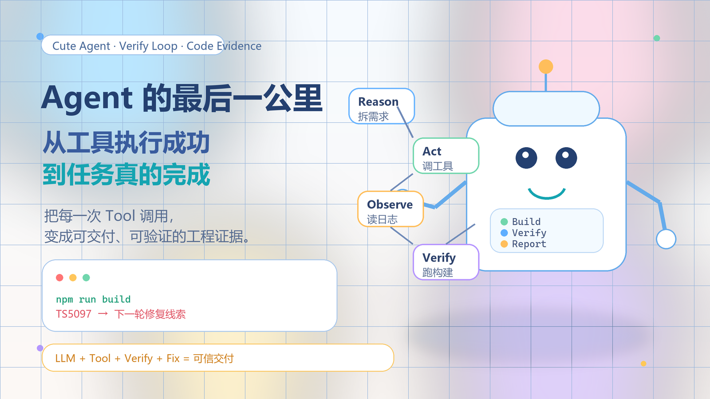

# Agent 的最后一公里：从“工具执行成功”到“任务真的完成”



## 核心结论（金字塔塔尖）

**前三篇文章已经说明了 Agent 是什么、Tool 怎么调度、多 Tool 如何工程化；但一个编程 Agent 真正可用，不止看它有没有调用工具，而要看它能不能把结果带到“可验收”的终点。**

一句话：

```text
可用的编程 Agent = LLM + Tool 调度 + 工程安全网 + 验收反馈闭环
```

如果说前三篇文章解决的是“让 LLM 长出手”，那么本文要补上的就是“让这只手知道自己有没有把活干完”。这一步很关键：**文件写成功，不等于项目能跑；命令执行过，不等于需求完成；模型说完成，不等于用户可以验收。**

在这个文件夹里，`src/mini-cursor.mjs` 已经能通过 `read_file`、`write_file`、`list_directory`、`execute_command` 四个工具创建一个 React TodoList 项目；`react-todo-app` 目录里也确实生成了应用代码、依赖文件和构建产物。但当我们进一步运行构建命令时，会发现一个真实问题：

```text
npm run build

src/main.tsx(4,17): error TS5097:
An import path can only end with a '.tsx' extension when 'allowImportingTsExtensions' is enabled.
```

这个错误非常有价值。它说明：**Agent 的终点不能停在“我写完了”，而必须停在“我验证过”。**

下面用四个层层递进的论点展开：

```text
1. 为什么验收是 Agent 的最后一公里
2. 如何把用户需求拆成可验证证据
3. 如何让失败结果进入下一轮反馈闭环
4. 为什么可观测性决定 Agent 能否产品化
```

---

## 论点一：Agent 的任务边界，不能由“模型回复”决定，而要由“验收证据”决定

### 1.1 前三篇文章解决了执行问题，但还没有完全解决完成问题

回顾这个系列的路径：

```text
第一篇：Agent = LLM + Memory + Tool + RAG + MCP + Skills
        解决“Agent 是什么”

第二篇：while (tool_calls) + ToolMessage + Promise.all
        解决“Tool 怎么被 LLM 调度”

第三篇：read + write + list + exec + maxIterations + spawn
        解决“多 Tool 如何协作完成工程任务”
```

这三步已经把 Agent 从“能说”推进到“能做”。但“能做”之后还有一个问题：**做得对不对？**

以 `src/mini-cursor.mjs` 里的任务为例，用户给 Agent 的不是一句简单指令，而是一组工程需求：

```js
const case1 = `
 创建一个功能丰富的React TodoList  应用:
 1. 创建项目:
 echo -e "n\nn" | pnpm create vite react-todo-app --template react-ts
 2.修改src/App.tsx ， 实现完整功能的TodoList :
 -添加、删除、标记完成
 - 分类筛选(全部/进行中/已完成)
 -统计信息显示
 - localStorage 数据持久化
 3.添加复杂样式
 - 渐变背景(蓝到紫)
 - 卡片阴影，圆角
 - 悬停效果
 4.添加动画:
 - 添加/删除时的过渡动画
 - 使用css transitions
5. 列出目录确定

注意: 使用pnpm 功能要完整， 样式要美观， 要有动画效果

之后 react-todo-app 项目中:
1.使用pnpm install 安装依赖
2.使用pnpm run dev 启动项目
`;
```


这里至少有五类验收目标：

| 需求 | 不能只看什么 | 应该看什么 |
|---|---|---|
| 创建 React + Vite 项目 | 不能只看命令是否执行 | `package.json`、`vite.config.ts`、`src/main.tsx` 是否存在 |
| 实现 TodoList 功能 | 不能只看 `write_file` 成功 | `App.tsx` 是否有添加、删除、切换、筛选、统计、持久化逻辑 |
| 添加复杂样式 | 不能只看 `App.css` 被写入 | 是否有渐变、卡片、阴影、hover、transition 等具体样式 |
| 安装依赖 | 不能只看命令跑过 | `node_modules`、lock 文件、构建命令是否能进入业务阶段 |
| 启动项目 | 不能只看 `pnpm run dev` 被调用 | dev server 是否真的启动、页面是否可访问、控制台是否无致命错误 |

这说明一个核心判断：**Agent 的输出不是一句“已完成”，而是一组证据。**

### 1.2 “工具调用成功”只是过程状态，不是业务完成

在 `src/all-tools.mjs` 中，`write_file` 成功后返回：

```js
return `成功写入 ${filePath}`;
```

`execute_command` 成功后返回：

```js
resolve(`命令行成功执行 ${command}${cwdInfo}`);
```

这两个返回值对 Agent 很重要，因为它们会作为 `ToolMessage` 进入下一轮上下文。但它们只能证明一件事：**这个工具动作本身完成了。**


它们不能直接证明：

- 写入的 TypeScript 代码是否能通过类型检查
- CSS 是否真的覆盖了用户要求的交互状态
- localStorage 逻辑是否在浏览器里可用
- dev server 是否能正常启动
- 生成页面是否符合用户对“功能丰富”“样式美观”的预期

这就像装修房子。工人说“墙刷完了”，只是一个施工状态；真正交付前，还要看墙面是否平整、插座是否通电、门窗是否能开合。**Agent 的 Tool 调用就是施工记录，验收才是交付标准。**

### 1.3 本目录里的 Todo 项目正好说明了这个差异

看 `react-todo-app/src/App.tsx`，它确实实现了很多需求：

| 需求点 | 代码证据 |
|---|---|
| 添加待办 | `addTodo(event)` 中读取 `input.trim()`，创建新 `Todo` |
| 删除待办 | `deleteTodo(id)` 中用 `filter` 移除 |
| 标记完成 | `toggleTodo(id)` 中切换 `completed` |
| 分类筛选 | `filter` 状态支持 `all`、`active`、`completed` |
| 统计信息 | `activeCount`、`completedCount`、`completionRate` |
| 本地持久化 | `STORAGE_KEY`、`loadTodos()`、`localStorage.setItem()` |
| 空状态 | `visibleTodos.length === 0` 时显示空状态 |


看 `react-todo-app/src/App.css`，样式也覆盖了用户要求的几个方向：

| 样式需求 | CSS 证据 |
|---|---|
| 渐变背景 | `.todo-shell` 中有 `linear-gradient(135deg, ...)` |
| 卡片阴影 | `.todo-panel`、`.stats-grid article`、`.todo-list li` 中有 `box-shadow` |
| 圆角 | 多处使用 `border-radius` |
| 悬停效果 | button、todo item 有 `:hover` 和 `transform` |
| 过渡动画 | 多处 `transition`，并定义了 `@keyframes slide-in` |
| 移动端适配 | `@media (max-width: 680px)` |


如果只验收“文件是否写入”，这个任务看起来已经完成。但进一步看 `react-todo-app/package.json`：

```json
{
  "scripts": {
    "dev": "vite",
    "build": "tsc -b && vite build",
    "preview": "vite preview"
  }
}
```

当执行：

```bash
npm run build
```

就会进入 TypeScript 编译，并暴露：

```text
src/main.tsx(4,17): error TS5097:
An import path can only end with a '.tsx' extension when 'allowImportingTsExtensions' is enabled.
```


对应文件 `react-todo-app/src/main.tsx` 中有这一行：

```ts
import App from './App.tsx'
```

在当前 TypeScript 配置下，应该改成：

```ts
import App from './App'
```

这就是验收环节的价值：**它把“看起来完成”的任务，推进到“可证明完成”的任务。**

---

## 论点二：验收不是最后随手跑一下命令，而是要从用户需求开始设计证据链

### 2.1 编程 Agent 应该把需求翻译成验收清单

在普通 ChatBot 场景下，用户问一个问题，模型回答即可。但编程 Agent 面对的是工程任务，工程任务天然应该有验收标准。

`case1` 的用户需求可以翻译成下面这张清单：

```text
用户说：创建 React TodoList
验收：react-todo-app/package.json 存在，依赖包含 react/react-dom/vite/typescript

用户说：添加、删除、标记完成
验收：App.tsx 中存在 addTodo / deleteTodo / toggleTodo，并绑定到表单、按钮、checkbox

用户说：分类筛选
验收：存在 all / active / completed 三种状态，并影响 visibleTodos

用户说：统计信息显示
验收：页面渲染全部任务、进行中、完成率

用户说：localStorage 持久化
验收：存在 getItem / setItem，刷新后数据可恢复

用户说：渐变背景、卡片阴影、悬停效果、动画
验收：CSS 中存在 gradient、box-shadow、:hover、transition、keyframes

用户说：安装依赖并启动项目
验收：install 成功，build 成功，dev server 可访问
```

这张清单的意义是：**让 Agent 的“完成”从主观判断变成客观证据。**

如果没有清单，LLM 很容易在最后一轮给出一句：

```text
已完成 React TodoList 项目，包含添加、删除、筛选、统计和本地存储。
```

这句话可能是真的，也可能只是模型基于自己刚写过的代码做出的概括。它没有经过独立验证。

如果有清单，Agent 最后一轮应该输出的是：

```text
已完成：
- 项目目录 react-todo-app 已创建
- App.tsx 覆盖添加/删除/完成切换/筛选/统计/localStorage
- App.css 覆盖渐变背景、卡片、hover、transition、slide-in 动画
- npm run build 已执行，但 TypeScript 编译失败：main.tsx 第 4 行导入 App.tsx 不符合当前配置

下一步：
- 将 import App from './App.tsx' 改为 import App from './App'
- 重新执行 npm run build
```

这才是工程语境里的真实反馈。

### 2.2 验收清单必须分层：文件、代码、构建、运行、体验

对编程 Agent 来说，验收可以分成五层：

```text
第一层：文件层
项目结构是否生成，目标文件是否存在

第二层：代码层
关键逻辑是否写入，类型和模块关系是否合理

第三层：构建层
lint / typecheck / build 是否通过

第四层：运行层
dev server 是否启动，页面是否可访问

第五层：体验层
用户要求的交互、样式、动画是否真的呈现
```

对应到这个目录：

| 验收层级 | 本目录中的证据 | 可以用什么 Tool 验证 |
|---|---|---|
| 文件层 | `react-todo-app/package.json`、`src/App.tsx`、`src/App.css` | `list_directory`、`read_file` |
| 代码层 | `addTodo`、`toggleTodo`、`deleteTodo`、`localStorage` | `read_file` + LLM 分析 |
| 构建层 | `npm run build` 的退出码和日志 | `execute_command` |
| 运行层 | `npm run dev` 或 `vite preview` 是否输出访问地址 | `execute_command` |
| 体验层 | 页面能否添加/筛选/删除，样式是否渲染 | 浏览器 Tool 或截图 Tool |

前三篇文章主要覆盖了前三类 Tool：读文件、写文件、执行命令。本文要强调的是：**Tool 不只是用来“生产结果”，也要用来“验证结果”。**

同一个 `execute_command`，既可以用于：

```bash
pnpm create vite react-todo-app --template react-ts
```

也可以用于：

```bash
npm run build
```

前者是生产动作，后者是验收动作。**一个成熟 Agent 必须同时拥有这两种意识。**

### 2.3 目录扫描不是形式动作，而是 Agent 的事实校准

`mini-cursor.mjs` 的需求里有一句：

```text
5. 列出目录确定
```

这句话很容易被忽略，但它其实是一个很重要的 Agent 工程习惯：**做完关键动作后，用事实重新校准上下文。**

为什么要列目录？

因为 LLM 对文件系统没有直接感知。它“认为”自己创建了 `react-todo-app`，但只有 `list_directory` 才能确认目录真的存在；它“认为”自己写入了 `src/App.tsx`，但只有读文件或列目录才能确认路径和文件名没有写错。

在多 Tool 场景里，Agent 的上下文可能出现三种偏差：

| 偏差类型 | 例子 | 后果 |
|---|---|---|
| 路径偏差 | 以为当前在项目根目录，实际在上一级目录 | 命令执行到错误位置 |
| 状态偏差 | 以为依赖已安装，实际安装失败 | 后续 dev/build 全部失败 |
| 内容偏差 | 以为代码写入成功，实际写到了错误文件 | 页面仍然是默认模板 |

`list_directory`、`read_file`、`execute_command` 的输出，就是让 Agent 从“想象中的世界”回到“真实文件系统”的锚点。

一个可靠的编程 Agent 应该像飞行员看仪表盘：不是凭感觉说“高度应该差不多”，而是不断读取高度、速度、航向，再决定下一步操作。**Tool 的返回值就是 Agent 的仪表盘。**

---

## 论点三：失败不是终点，而是下一轮 Reason 的输入

### 3.1 ToolMessage 的价值，在失败时最明显

前三篇文章已经讲过 `ToolMessage`：

```js
messages.push(new ToolMessage({
  content: toolResult,
  tool_call_id: toolCall.id,
}));
```

当工具成功时，`ToolMessage` 告诉 LLM：“这一步完成了。”

但当工具失败时，`ToolMessage` 更重要。它告诉 LLM：

```text
不是任务失败了，而是当前策略失败了。
请基于错误信息重新推理。
```

这正是 ReAct 的完整含义：

```text
Reason：我需要验证项目能否构建
Act：执行 npm run build
Observe：TS5097，main.tsx 第 4 行导入 .tsx 后缀不合法
Reason：错误不是 App 逻辑问题，而是模块导入路径问题
Act：读取 main.tsx
Act：把 import App from './App.tsx' 改成 import App from './App'
Act：重新执行 npm run build
Observe：构建通过或出现新的错误
```

这条链路里，失败不是异常退出，而是信息回流。**Agent 的智能性不体现在永远不犯错，而体现在能不能读懂错误、缩小问题、修复后再验证。**

### 3.2 当前 Todo 项目的构建错误，是一条标准反馈链

这次构建失败的信息很具体：

```text
src/main.tsx(4,17): error TS5097:
An import path can only end with a '.tsx' extension when 'allowImportingTsExtensions' is enabled.
```

它包含四个关键信息：

| 信息 | 含义 |
|---|---|
| `src/main.tsx` | 问题文件 |
| `(4,17)` | 问题位置 |
| `TS5097` | TypeScript 错误类型 |
| `'.tsx' extension` | 问题原因是导入路径后缀 |

这类错误对 Agent 很友好，因为它指向明确，修复路径短：

```text
1. read_file("react-todo-app/src/main.tsx")
2. 找到 import App from './App.tsx'
3. write_file 修改为 import App from './App'
4. execute_command("npm run build", directoryPath: "react-todo-app")
```

也就是说，**构建日志本身可以直接变成下一轮 Tool 调用计划。**

这比让 LLM 自己猜“哪里可能错了”可靠得多。没有构建日志，LLM 只能从代码表面猜；有构建日志，LLM 可以按错误定位。

### 3.3 错误也要结构化，否则 Agent 很难稳定自修复

`src/all-tools.mjs` 里的 `execute_command` 目前返回：

```js
resolve(`命令执行失败，退出码：${code}\n 错误：${errorMsg}`);
```

这个设计已经比直接 `throw` 更好，因为它把错误作为内容交回了 LLM。但还有一个工程化改进方向：**让命令结果结构化。**

例如可以让 Tool 返回：

```json
{
  "ok": false,
  "command": "npm run build",
  "cwd": "react-todo-app",
  "exitCode": 1,
  "stdout": "...",
  "stderr": "src/main.tsx(4,17): error TS5097: ...",
  "nextHint": "read react-todo-app/src/main.tsx and inspect line 4"
}
```

结构化的好处有三个：

| 好处 | 说明 |
|---|---|
| 更容易判断成功失败 | LLM 不需要从自然语言里猜“成功执行”还是“失败” |
| 更容易定位问题 | `stderr`、`exitCode`、`cwd` 分开存放 |
| 更容易生成下一步动作 | `nextHint` 可以作为轻量级引导 |

这不是为了把 LLM 变成 if/else 规则机，而是为了减少它在无关信息上的理解成本。**上下文越干净，Agent 越稳定。**

### 3.4 `stdio: 'inherit'` 让用户看见过程，但 Agent 也需要拿到日志

第三篇文章已经讲过：

```js
const child = spawn(cmd, args, {
  cwd,
  stdio: 'inherit',
  shell: true,
});
```

`stdio: 'inherit'` 的优点是用户可以实时看到输出，体验更像 Claude Code 或 Cursor：命令在跑，日志在刷，用户知道 Agent 没卡死。

但从“自修复”的角度看，只让用户看到还不够，Agent 自己也要拿到日志。否则会出现一个矛盾：

```text
用户看见了错误
Agent 没有完整 stderr
下一轮只能得到“退出码 1”
```

这会让 Agent 很难自动修复。

更理想的执行工具应该同时满足两点：

```text
1. 实时把 stdout/stderr 打到终端，让用户可见
2. 同时收集 stdout/stderr，作为 ToolMessage 返回给 LLM
```

也就是：

```text
可见性给用户
结构化日志给 Agent
```

这是“人机协作”和“Agent 自主修复”之间的平衡点。

---

## 论点四：收尾篇真正要补的是“可观测性”，它决定 Agent 能不能产品化

### 4.1 Demo 关注能力，产品关注可观测性

一个 demo 只要能跑通一次，就足够证明概念：

```text
LLM 调工具 → 写文件 → 执行命令 → 返回结果
```

但产品化 Agent 必须回答更多问题：

```text
它现在执行到哪一步？
哪一步失败了？
失败原因是什么？
失败后有没有重试？
重试是否改变了策略？
最终哪些需求完成了，哪些没完成？
用户如何复现和验收？
```

这些问题都属于可观测性。

在这个目录里，已经能看到可观测性的雏形：

| 代码位置 | 可观测性设计 |
|---|---|
| `readFileTool` | 打印读取路径和字节数 |
| `writeFileTool` | 打印写入路径和内容长度 |
| `listDirectoryTool` | 打印目录项数量 |
| `executeCommandTool` | 打印命令和工作目录 |
| `mini-cursor.mjs` | 打印“正在等待第 i 次 AI 思考” |

这些日志很朴素，但方向正确。它们让用户知道 Agent 不是黑盒。

### 4.2 但真正的验收报告，还需要从日志升级为任务账本

当前日志是按 Tool 打印的：

```text
[工具调用] write_file(...)
[工具调用] execute_command(...)
正在等待第 3 次 AI 思考...
```

这适合调试，但还不适合最终交付。用户最后真正关心的是：

```text
需求 1：创建项目       完成
需求 2：Todo 功能      完成
需求 3：样式动画       完成
需求 4：依赖安装       部分完成
需求 5：构建验证       失败，原因是 main.tsx 导入路径
需求 6：启动验证       未完成，因为构建未通过
```

也就是说，Agent 需要一份“任务账本”：

| 字段 | 作用 |
|---|---|
| `requirement` | 原始需求 |
| `evidence` | 对应证据，比如文件、函数、命令日志 |
| `status` | completed / failed / skipped |
| `risk` | 剩余风险 |
| `nextAction` | 下一步建议或自动修复动作 |

这种账本不是给机器看的形式主义，而是给用户建立信任的交付物。**用户不需要读完整日志，但需要知道每个需求是否真的落地。**

### 4.3 编程 Agent 的验收 Tool，可以成为新的工具类型

前三篇文章里的 Tool 类型主要有四种：

```text
read_file
write_file
list_directory
execute_command
```

收尾篇可以再引出一种新 Tool：`verify_project`。

它不是新能力的堆砌，而是把常见验收动作封装起来：

```js
const verifyProjectTool = tool(
  async ({ directoryPath }) => {
    // 1. 读取 package.json
    // 2. 判断是否存在 build / dev 脚本
    // 3. 执行 npm run build 或 pnpm run build
    // 4. 收集 stdout/stderr/exitCode
    // 5. 返回结构化验收结果
  },
  {
    name: 'verify_project',
    description: '验证前端项目是否可构建，并返回结构化验收报告',
    schema: z.object({
      directoryPath: z.string().describe('要验证的项目目录'),
    }),
  }
);
```

有了这个 Tool，LLM 不需要每次临时想“我该怎么验收一个 Vite 项目”。它只需要知道：

```text
写完项目后，调用 verify_project
失败后，根据 verify_project 的结构化结果修复
修复后，再调用 verify_project
```

这就是 Skills 的雏形。**当一组 Tool 调用和验收动作反复出现，就应该被沉淀成可复用技能。**

### 4.4 从 Tool 到 Skill：把“做事流程”固化下来

第一篇里提到过：

```text
Agent = LLM + Memory + Tool + RAG + MCP + Skills
```

前三篇重点讲 Tool，本文最后正好回到 Skills。

以“创建 React TodoList 项目”为例，一个成熟 Skill 不应该只包含创建步骤：

```text
1. 创建 Vite 项目
2. 写 App.tsx
3. 写 App.css
4. 安装依赖
```

它还应该包含验收步骤：

```text
5. 读取 package.json 确认脚本
6. 执行 build
7. 如果 build 失败，读取错误文件并修复
8. 重新 build
9. 启动 dev 或 preview
10. 输出验收报告
```

这才是一个完整 Skill：

```text
Skill = 生产步骤 + 验收步骤 + 失败修复策略 + 最终报告
```

换句话说，**Tool 是手，Skill 是工序；验收闭环就是工序里的质检。**

---

## 一个更完整的 Agent 执行流程

结合四篇文章，可以把编程 Agent 的完整流程收束成下面这张图：

```text
                         用户需求
                            │
                            ▼
                 ┌────────────────────┐
                 │  LLM Reason/Plan    │
                 │  拆任务 + 选工具      │
                 └─────────┬──────────┘
                           │
                           ▼
                 ┌────────────────────┐
                 │  Tool 执行层         │
                 │  read/write/list/exec│
                 └─────────┬──────────┘
                           │
                           ▼
                 ┌────────────────────┐
                 │  Observe 观察层      │
                 │  ToolMessage + 日志  │
                 └─────────┬──────────┘
                           │
                           ▼
                 ┌────────────────────┐
                 │  Verify 验收层       │
                 │  文件/代码/构建/运行 │
                 └─────────┬──────────┘
                           │
            ┌──────────────┴──────────────┐
            ▼                             ▼
      验收通过                       验收失败
            │                             │
            ▼                             ▼
      输出交付报告               错误进入下一轮 Reason
                                          │
                                          └── 回到 Tool 执行层
```

这张图比前三篇多了一个关键节点：`Verify 验收层`。

没有它，Agent 的循环是：

```text
Reason → Act → Observe → Answer
```

有了它，Agent 的循环变成：

```text
Reason → Act → Observe → Verify → Fix or Answer
```

这一步，就是编程 Agent 从“自动执行器”走向“工程协作者”的分界线。

---

## 四篇文章合在一起，形成完整闭环

到这里，这个系列可以形成一条完整路径：

```text
第一篇：Agent 是什么
LLM 有五个短板：无状态、不能执行、没有私有知识、缺实时信息、难编排长任务
所以需要 Memory、Tool、RAG、MCP、Skills

第二篇：Agent 怎么动手
Tool 通过 async 函数 + description + Zod schema 暴露能力
LLM 通过 tool_calls 声明意图
运行时执行 Tool，再用 ToolMessage 回填结果

第三篇：Agent 怎么完成复杂工程任务
多个 Tool 协作时，需要自完备 Tool、操作手册级 Prompt、maxIterations 断路器、spawn 子进程隔离
Agent 从“能读文件”推进到“能创建 React 项目”

第四篇：Agent 怎么证明自己完成了任务
写完文件和执行命令只是过程
真正的终点是文件、代码、构建、运行、体验五层验收
失败日志要进入下一轮 Reason，形成自修复闭环
```

如果压缩成一个最终公式：

```text
编程 Agent =
LLM
+ Tool Use
+ Message Loop
+ Multi-Tool Engineering
+ Verification Feedback Loop
```

再具体一点：

```text
编程 Agent =
LLM
+ read/write/list/exec
+ tool_calls + ToolMessage
+ System Prompt 规则 + maxIterations + spawn 隔离
+ build/dev/log/report 验收闭环
```

---

## 全文收束

**这篇收尾文章想补的不是一个新概念，而是一个容易被忽略的工程事实：Agent 的完成状态不能由 Agent 自己宣布，必须由外部证据证明。**

在这个文件夹里，`mini-cursor.mjs` 已经让 LLM 能调用四个工具完成项目创建；`react-todo-app/src/App.tsx` 和 `App.css` 也说明 Agent 确实写出了有功能、有样式的 TodoList。但 `npm run build` 暴露的 `TS5097` 又提醒我们：**只要没有验收，完成就是不可靠的。**

所以，一个成熟的编程 Agent 不应该只会说：

```text
我已经完成了。
```

它应该能说：

```text
我完成了哪些需求；
每个需求对应什么证据；
我跑了哪些验证；
哪些验证通过；
哪些验证失败；
失败原因是什么；
下一步如何修复。
```

这才是从“会调用工具的 LLM”到“可信工程协作者”的最后一公里。

**Agent 的本质不是替人把键盘敲完，而是把任务推进到可交付、可验证、可追责的状态。**
