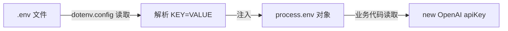
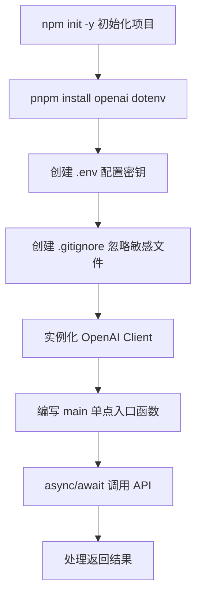

# 从零到一：用 Node.js 调用 DeepSeek 大模型 API 完整实战教程

## 前言：为什么每个开发者都应该学会调用大模型 API？

2024 年以来，大模型（LLM）彻底改变了软件开发的方式。从 ChatGPT 到 DeepSeek，AI 能力正在变成像数据库、缓存一样的基础设施。**调用大模型 API 不再是算法工程师的专利，而是每个后端/全栈开发者的必备技能。**

本文将从零开始，带你完成：

- 初始化一个 Node.js AI 项目
- 安全管理 API Key
- 使用 OpenAI SDK（事实标准）调用 DeepSeek API
- 理解 async/await 异步流程控制
- 掌握 AIGC 工程化的核心套路

读完本文，你将能够把大模型能力集成到任何 Node.js 项目中。

> 本文基于英伟达 AI 证书课程中的实战环节整理，适合有一定 JavaScript 基础、想快速上手 AI 开发的工程师。

---

## 一、项目初始化：AI 项目本质是后端项目

首先要明确一个认知：**AI 项目 / Agent 项目，几乎都是后端项目。** 大模型运行在云端，你的代码负责组织 prompt、调用 API、处理返回结果。这和传统的 Web 后端开发没有本质区别。

### 1.1 初始化 Node 项目

```bash
mkdir ai-demo && cd ai-demo
npm init -y
```

执行后生成 `package.json`，项目骨架就搭好了。

### 1.2 安装依赖

```bash
npm install openai dotenv
```

两个核心依赖：

| 依赖 | 作用 |
|------|------|
| `openai` | OpenAI 官方 SDK，已成为调用各大模型 API 的**事实标准** |
| `dotenv` | 从 `.env` 文件加载环境变量到 `process.env` |

> 💡 **关于包管理器**：推荐使用 `pnpm`。它通过硬链接+软链接的方式复用磁盘空间，多个项目共享同一份依赖。安装一次，全局可用：
> ```bash
> npm install -g pnpm
> pnpm install openai dotenv
> ```

---

## 二、API Key 的安全管理

### 2.1 核心原则：密钥绝对不能提交到 Git

API Key 就是你的数字身份，泄露意味着别人可以盗刷你的额度。所以第一件事就是配置 `.gitignore`：

```bash
echo ".env" >> .gitignore
echo "node_modules" >> .gitignore
```

`.gitignore` 告诉 Git 哪些文件不需要版本控制：

```gitignore
# .gitignore
node_modules/
.env
```

### 2.2 .env 文件：环境变量的配置中心

创建 `.env` 文件，存放你的 API 密钥：

```bash
# .env 文件格式：KEY=VALUE（大写 + 等号 + 值）
DEEPSEEK_API_KEY=sk-xxxxxxxxxxxxxxxxxxxxxxxx
DEEPSEEK_BASE_URL=https://api.deepseek.com/v1
```

格式规则就两条：
- **KEY 用大写**，这是社区约定
- `KEY=VALUE`，每行一个，不要加引号

`.env` 留在本地跑，`.gitignore` 保证远程不提交。本地和远程的边界清晰分离。

### 2.3 dotenv 如何工作？

```javascript
import dotenv from 'dotenv';
dotenv.config(); // 这行代码做了什么？

console.log(process.env.DEEPSEEK_API_KEY); // sk-xxx...
```

`dotenv.config()` 的执行流程：



一句话：**dotenv 把 `.env` 文件的内容读出来，挂载到 `process.env` 对象上，之后你的代码就可以通过 `process.env.XXX` 访问了。**

---

## 三、深入理解 process：操作系统的核心概念

在继续之前，有必要搞清楚 `process.env` 中的 `process` 到底是什么。

### 3.1 什么是进程？

当你在终端执行：

```bash
node index.mjs
```

操作系统会做一件事：**启动一个进程**。这个进程是程序的一次执行实例，操作系统为它分配三大资源：

```
┌─────────────────────────┐
│         进程             │
├─────────────────────────┤
│  💾 内存空间（堆、栈）    │
│  ⏱️  CPU 时间片          │
│  📁 文件描述符（IO）      │
└─────────────────────────┘
```

**进程是操作系统分配资源的最小单位。** Node.js 把这个操作系统进程封装成了一个全局对象——**`process`**。

### 3.2 process.env 是什么？

`process.env` 是一个包含所有环境变量的对象。环境变量从哪里来？

1. **操作系统级别的**：系统启动时设置的环境变量
2. **Shell 级别的**：终端会话中 `export` 的变量
3. **dotenv 注入的**：从 `.env` 文件读进来的

```javascript
// process 是全局对象，任何文件中都能直接访问
console.log(process.env.HOME);    // 用户主目录
console.log(process.env.PATH);    // 系统路径
console.log(process.env.DEEPSEEK_API_KEY); // 你的 API Key（dotenv 注入的）
```

> 🔑 **关键理解**：进程=资源容器，环境变量=传给进程的配置参数。你写配置在 `.env`，dotenv 读进来放到 `process.env`，代码再从 `process.env` 取出来用——这是一条标准的数据流向。

---

## 四、ES6 模块化：为什么用 .mjs 后缀？

### 4.1 两种模块化方案

JavaScript 的模块化经历了漫长的演进，最终 ES6（ES2015）推出了官方标准——**ESM（ES Modules）**：

```javascript
// ESM 写法 —— 现代标准
import { OpenAI } from 'openai';
import dotenv from 'dotenv';

// CommonJS 写法 —— 旧时代遗留
const { OpenAI } = require('openai');
const dotenv = require('dotenv');
```

### 4.2 .mjs vs .js

Node.js 中 `.mjs` 后缀的含义是 **Module JS**——明确告诉 Node 这个文件使用 ESM 规范。

如果你更喜欢 `.js` 后缀，可以在 `package.json` 中声明：

```json
{
  "type": "module"
}
```

这样项目中所有 `.js` 文件都默认以 ESM 方式解析。

> ⚠️ **注意**：如果你的 `package.json` 中写的是 `"type": "commonjs"`（本文示例项目就是这样），又想用 `import` 语法，就用 `.mjs` 后缀。`.mjs` 始终是 ESM，不受 `package.json` 影响。

---

## 五、核心实战：调用 DeepSeek Chat Completion API

### 5.1 完整代码

```javascript
// index.mjs
import dotenv from 'dotenv';
import { OpenAI } from 'openai';

dotenv.config();

// 实例化客户端
const client = new OpenAI({
    apiKey: process.env.DEEPSEEK_API_KEY,
    baseURL: process.env.DEEPSEEK_BASE_URL,
});

const main = async () => {
    console.log('🚀 程序开始运行');

    const result = await client.chat.completions.create({
        model: 'deepseek-chat',
        messages: [
            { role: 'user', content: '你好，请介绍一下你自己' }
        ]
    });

    console.log(result.choices[0].message.content);
    console.log('✅ 程序结束');
};

main();
```

### 5.2 逐行解析

#### 实例化客户端

```javascript
const client = new OpenAI({
    apiKey: process.env.DEEPSEEK_API_KEY,
    baseURL: process.env.DEEPSEEK_BASE_URL,
});
```

**为什么 `baseURL` 指向 DeepSeek？** OpenAI SDK 默认请求 `https://api.openai.com`，但 DeepSeek、通义千问、Moonshot 等国产模型都兼容 OpenAI 的 API 格式。**改一个 `baseURL`，就能用同一套 SDK 调用不同厂商的模型。** 这就是 OpenAI SDK 成为"事实标准"的原因。

#### 发送聊天请求

```javascript
const result = await client.chat.completions.create({
    model: 'deepseek-chat',
    messages: [
        { role: 'user', content: '你好，请介绍一下你自己' }
    ]
});
```

`messages` 数组是 Chat Completion API 的核心。每条消息由两个字段组成：

| 字段 | 说明 |
|------|------|
| `role` | 角色：`system`（系统指令）、`user`（用户）、`assistant`（AI） |
| `content` | 消息内容 |

多轮对话就是在 `messages` 数组中追加历史消息：

```javascript
messages: [
    { role: 'system', content: '你是一个经验丰富的后端工程师' },
    { role: 'user', content: 'Node.js 如何处理高并发？' },
    { role: 'assistant', content: 'Node.js 采用事件驱动...' },
    { role: 'user', content: '那和 Go 的协程比呢？' }  // 新一轮问题
]
```

---

## 六、深入理解 async/await：掌控异步执行顺序

### 6.1 问题的根源

JavaScript 是单线程的，但网络请求是耗时的。看这段代码：

```javascript
console.log('1. 开始');

setTimeout(() => {
    console.log('3. 1秒后执行');
}, 1000);

console.log('2. 结束');
```

输出是 `1 → 2 → 3`，和你写的顺序不同！**JS 代码的编写顺序和执行顺序有时候不同。** 这是因为 `setTimeout` 是异步任务——它不会阻塞主线程，而是被丢到任务队列中等待执行。

API 请求同理——一个 Chat API 调用可能需要几百毫秒甚至几秒，如果同步阻塞，整个程序就卡住了。

### 6.2 async/await 的魔法

`async/await` 解决的核心问题：**让异步代码看起来像同步代码，同时不阻塞事件循环。**

```javascript
const main = async () => {
    console.log('1. 程序开始');

    // await 会"卡住"这一行，等待 API 返回结果后继续执行
    const result = await client.chat.completions.create({
        model: 'deepseek-chat',
        messages: [{ role: 'user', content: 'hello' }]
    });

    // 这行代码在 API 返回后才执行
    console.log('2. AI 回复:', result.choices[0].message.content);

    setTimeout(() => {
        console.log('4. 1秒后执行');
    }, 1000);

    console.log('3. 程序结束');
};

main();
```

执行顺序：`1 → (等待API返回) → 2 → 3 → 4`

**`async`** 修饰符告诉引擎"这个函数包含异步操作"，**`await`** 在后面等待 Promise 完成，拿到结果后才继续往下执行。

### 6.3 对比：回调地狱 vs async/await

```javascript
// ❌ 回调地狱 —— 嵌套地狱，难以阅读
client.chat.completions.create({...}, (err, result1) => {
    if (err) return;
    client.chat.completions.create({...}, (err, result2) => {
        if (err) return;
        client.chat.completions.create({...}, (err, result3) => {
            // 越来越多层...
        });
    });
});

// ✅ async/await —— 扁平化，像读小说一样
const result1 = await client.chat.completions.create({...});
const result2 = await client.chat.completions.create({...});
const result3 = await client.chat.completions.create({...});
```

**async/await 最大的价值不是性能，而是代码可读性。** 你写代码时按照"先做A，再做B，然后做C"的人类思维，而不是"注册回调，等通知"的机器思维。

---

## 七、开发工具提效

### 7.1 nodemon：自动重启

每次改代码都要手动 `node index.mjs` 很烦人。`nodemon` 监听文件变化，自动重启进程：

```bash
npm install -g nodemon
nodemon index.mjs
```

保存文件 → 自动重启 → 看到效果。开发体验直接上一个台阶。

### 7.2 完整项目结构

```
ai-demo/
├── .env              # API Key（不提交）
├── .gitignore        # 声明忽略文件
├── package.json      # 项目配置
├── index.mjs         # 入口文件
└── node_modules/     # 依赖（不提交）
```

---

## 八、AIGC 工程化开发流程总结

通过以上实战，可以提炼出 AI 项目的通用开发模式：



**核心套路就八个步骤：**

1. **`npm init -y`** → 项目初始化
2. **`pnpm install`** → 装依赖（openai + dotenv）
3. **配置 `.env`** → API Key 留在本地
4. **配置 `.gitignore`** → 保证 Key 不上传
5. **实例化 `client`** → 指定 `baseURL` + `apiKey`
6. **编写 `main` 函数** → 单点入口，统一管理
7. **`async/await`** → 控制异步执行顺序
8. **处理 `result.choices[0].message.content`** → 取到 AI 回复

> 📌 **记住这个模式**。无论是调用 DeepSeek、OpenAI、通义千问，还是做 RAG、Agent、Function Calling，基础骨架都是这八步。变的是 prompt 复杂度和业务逻辑，不变的是这个流程。

---

## 九、进阶方向

掌握基础调用之后，你可以朝这些方向深入：

| 方向 | 说明 |
|------|------|
| **Prompt Engineering** | 系统提示词设计、Few-shot、Chain-of-Thought |
| **Function Calling** | 让大模型调用你的函数，连接外部系统 |
| **RAG（检索增强生成）** | 结合向量数据库，让模型"知道"私有知识 |
| **Agent 开发** | 多步推理 + 工具调用，实现自主任务执行 |
| **Streaming** | 流式返回，实现打字机效果 |

> 🧠 **学习建议**：吴恩达（Andrew Ng）与 DeepLearning.AI 推出的 [ChatGPT Prompt Engineering for Developers](https://www.deeplearning.ai/short-courses/chatgpt-prompt-engineering-for-developers/) 课程是 Prompt Engineering 最好的入门资料，强烈推荐。

---

## 结语

本文从 `npm init` 开始，一步步带你走通了调用大模型 API 的完整链路。你学到了：

- **安全实践**：`.env` + `.gitignore` 管理密钥
- **操作系统概念**：进程是资源分配的最小单位，`process` 是它在 Node.js 中的体现
- **模块化方案**：ESM vs CommonJS，`.mjs` 的含义
- **OpenAI SDK**：一行 `baseURL` 切换不同厂商
- **异步控制**：`async/await` 让异步代码像同步一样易读
- **工程化套路**：AIGC 项目开发的八步标准流程

**AI 时代，调用 API 不是终点，而是起点。** 把这套工程流程内化成肌肉记忆，然后去探索 Prompt Engineering、Agent 开发、RAG 等更深的水域。

---

*如果这篇文章对你有帮助，欢迎点赞、收藏、评论。有问题也可以在评论区交流！* 🚀
