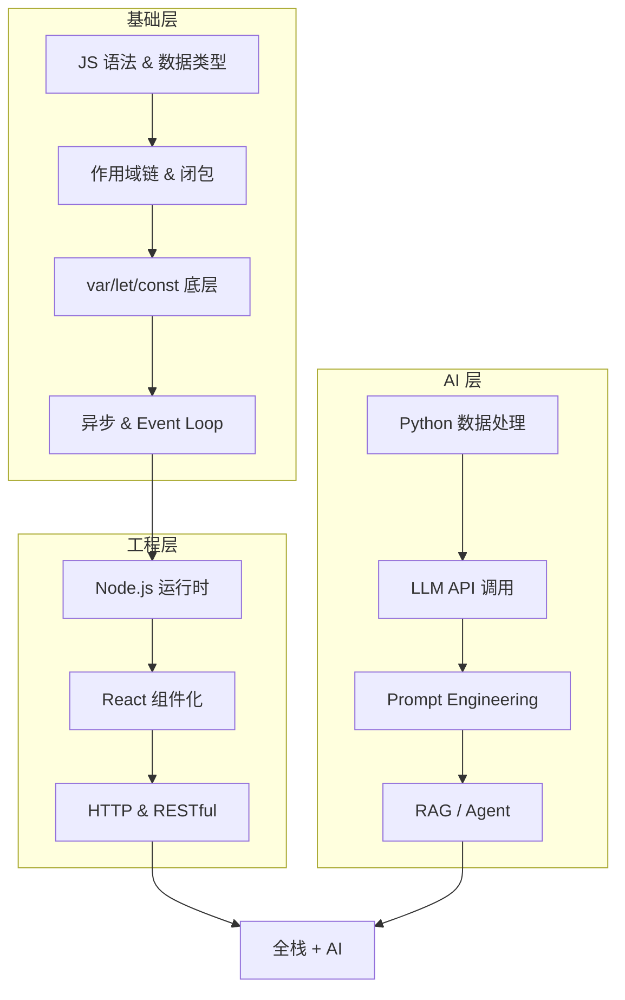
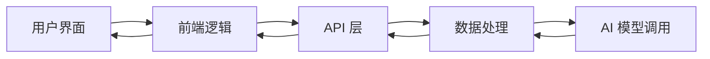

## 五、再往前走一步：Python + AI 实战

JS 给了我理解程序运行时的心智模型，Python 则带着我推开了 AI 的大门。

### 5.1 为什么是 Python？

全栈路线里，Python 和 JavaScript 是两把不同的刀。

JS 统治浏览器，Python 统治数据与 AI 生态。从一行代码就能看出 Python 的简洁气质：

```python
L = ['高强', 500, '张', '俊']

L[:3]     # ['高强', 500, '张']      —— 前三个
L[-2:]    # ['张', '俊']              —— 后两个  
L[::-1]   # ['俊', '张', 500, '高强']  —— 反转
```

> 🧩 **和 JS 数组的思维差异**：Python 的 `list` 是一个"可变序列容器"，可以塞不同类型的元素，操作偏数学切片思维。JS 数组是稀疏的、有 `length` 自动维护、原型链上挂了一堆方法。两种语言思维切换，在全栈路上不是负担——你会开始关注**"这个语言为什么这样设计"**，而不是"这个语法怎么背"。

---

### 5.2 第一次对话大模型：不到 20 行代码

我用的第一个 AI API 是 DeepSeek，调用方式和 OpenAI SDK 完全兼容：

```python
from openai import OpenAI

client = OpenAI(
    api_key="sk-xxxxxxxx",         # 替换为你的 key
    base_url="https://api.deepseek.com/v1"
)

def get_response(prompt):
    response = client.chat.completions.create(
        model="deepseek-chat",
        messages=[
            {"role": "user", "content": prompt}
        ]
    )
    return response.choices[0].message.content
```

就这 20 行——你就能跟一个几百亿参数的大模型对话了。

但如果你只是复制粘贴跑通就完事，那等于什么也没学到。真正有意思的藏在 `messages` 这个参数里。

---

### 5.3 `messages` 才是理解 LLM 的第一把钥匙

很多人第一次看这段代码，注意力全在 `model` 和 `api_key` 上。但 `messages` 才是整个对话式 AI 的灵魂——它不是一个简单的"输入字符串"，而是一个**对话历史数组**：

```python
messages = [
    {"role": "system",    "content": "你是一个亚马逊跨境电商运营专家。"},
    {"role": "user",      "content": "帮我写充气青蛙的英文卖点"},
    {"role": "assistant", "content": "好的，以下是 5 个卖点..."},
    {"role": "user",      "content": "再加一条关于环保材质的卖点"},
]
```

三种 role，各司其职：

| role | 作用 | 一句话理解 |
|------|------|-----------|
| `system` | 设定 AI 的身份、语气、行为边界 | 给员工写岗位说明书 |
| `user` | 你提出的问题和指令 | 你对同事说的话 |
| `assistant` | AI 之前的回复 | 聊天记录 |

这个数据结构，就是 ChatGPT 能"记住上下文"的全部秘密：

```
每次发请求 → 把之前的对话历史全部带上 → 模型"看起来"有了记忆
```

> ⚠️ **一个容易被忽略的性能陷阱**：多轮对话时，`messages` 数组越滚越大。每轮请求都要把整个历史重传一次，**Token 消耗是线性增长的**。生产环境中，你需要在适当的时候截断历史（只保留最近 N 轮），否则成本和延迟都会失控。

---

### 5.4 Prompt Engineering 的本质：精准沟通

同样的模型，同样的 API，不同的人写 Prompt，输出天差地别。

我的理解是——**Prompt Engineering 不是"写代码"，而是"写说明书"**。代码是给机器执行的，Prompt 是给一个"知识渊博但缺乏上下文"的智能体沟通的。

先看我踩过的坑：

```python
# ❌ 模糊的 prompt —— 模型自由发挥，结果不可控
prompt = "帮我写一个产品描述"

# ✅ 结构化的 prompt —— 角色、任务、格式、边界，一个不缺
prompt = """
你是一名亚马逊跨境电商运营专家。

产品：PVC充气发光青蛙儿童水上玩具

请完成以下任务：
1. 撰写一条英文商品标题，20 词以内
2. 写出 5 条英文卖点
3. 评估美元价格区间

Output the result in json format with three properties
called title, selling_points and price_range.
"""
```

好的 Prompt 有四个要素，缺一个都会让输出打折：

| 要素 | 作用 | 反例 |
|------|------|------|
| **角色设定** | 框定知识域和语气 | 不说角色，模型回答会像"百科全书" |
| **任务分解** | 把复杂需求拆成明确步骤 | "帮我写个文案"——模型不知道你想要多少字、什么风格 |
| **格式约束** | 指定输出结构 | 不指定格式，模型可能返回一大段自然语言，解析不了 |
| **边界限定** | 字数、语言、范围 | 不限制可能输出 200 词标题或中英混杂 |

> 💡 **进阶技巧：Few-shot（少样本示例）**
>
> 对于复杂任务，光说规则不如直接给例子。一个 input → output 的示例，抵一千字说明：
>
> ```python
> prompt = """
> 将中文产品名翻译成适合亚马逊的英文标题，参考示例：
>
> 示例： "儿童充气泳池"
>      → "Kids' Inflatable Swimming Pool for Backyard Fun"
>
> 现在请翻译："PVC充气发光青蛙水上玩具"
> """
> ```
>
> 示例的作用是：让模型**对齐你的审美和预期**，而不是凭空猜测"你想要什么样的输出"。

---

### 5.5 JSON 输出：让 AI 从"聊天"变"工具"

让模型返回 JSON，是 Demo 和产品之间的分水岭。

因为一旦输出是结构化的，你的代码就能**自动化消费**它：

```python
import json

response_text = get_response(prompt)

# 防御性解析：模型可能返回被 markdown 代码块包裹的 JSON
if response_text.startswith("```"):
    response_text = response_text.split("```")[1]
    if response_text.startswith("json"):
        response_text = response_text[4:]

result = json.loads(response_text.strip())

# 直接拿结构化数据
print(result["title"])         # 标题
print(result["price_range"])   # 价格区间
```

这段代码教会我三件事：

1. **JSON 是 AI 和代码之间的协议**。自然语言给人读，JSON 给机器读。让模型输出 JSON，你的应用才能**规模化处理** AI 的产出。
2. **永远做防御性解析**。模型不一定严格按格式输出——可能多打一个换行、包裹了 markdown 标记、引用号不规范。**不要把模型的输出当标准输入处理。**
3. **生产环境用 JSON Mode**。大多数模型现在支持 `response_format={"type": "json_object"}`，这会强制输出合法 JSON，比 prompt 里写"请输出 json"可靠得多。

---

### 5.6 两个你必须知道的核心参数

```python
response = client.chat.completions.create(
    model="deepseek-chat",
    temperature=0.7,      # 创造性控制器
    max_tokens=500,       # 输出长度上限
    messages=[...]
)
```

| 参数 | 范围 | 怎么选 |
|------|------|--------|
| `temperature` | 0 ~ 2 | 客服/事实提取 → 0 ~ 0.3；创意写作/脑暴 → 0.8 ~ 1.0 |
| `max_tokens` | 按模型而定 | 根据预期输出长度设置，**防止单次请求费用失控** |

这两个参数背后是一个核心权衡：**可控性 vs 创造性**。

做客服机器人要高可控（低温度），做文案生成要多样性（适当提高温度）。没有"最好"的参数值，只有**匹配场景**的参数值。

---

### 5.7 回头看：这条链路的完整闭环

```
用户输入产品信息
    ↓
构造结构化 Prompt（角色 + 分解 + 格式 + 边界）
    ↓
通过 OpenAI SDK → DeepSeek API
    ↓
模型返回 JSON 格式商品文案
    ↓
Python 解析 JSON → 自动入库 / 展示 / 批量处理
```

这就已经是一个**最小化 AI 应用**的完整骨架了。

它还缺什么？至少还有三块：

- **流式输出**（`stream=True`，像 ChatGPT 那样一个字一个字往外蹦）
- **多轮对话记忆**（messages 数组累积 + 定期截断）
- **错误重试**（API 超时、限流——生产环境必备）

但骨架已经有了。后面加什么，都是在这个骨架上长肌肉。

---

## 六、学习路线总结：大一真正学会的是什么

### 技术路线图



但大一真正有价值的，不是学会了哪个框架——而是**学会了怎么学**。

### 五个学习方法论的转变

| 维度 | ❌ 以前 | ✅ 现在 |
|------|--------|--------|
| **遇到报错** | 搜 CSDN → 贴代码求问 | 读报错堆栈 → 定位自己的代码 → 查官方文档 |
| **看教程** | 连续看 3 小时视频，代码一行没写 | 看 15 分钟 → 关掉 → 自己实现 → 对比差异 |
| **学知识点** | `var/let/const` 看完区别就过 | 追到作用域链 → 变量提升 → 执行上下文 → 栈/堆内存 |
| **记笔记** | 复制粘贴文档，写完再也没翻过 | 记录"为什么这样设计"和"我踩了什么坑" |
| **用 AI** | 让 AI 直接写完整代码 | 让 AI 解释原理、指出优化点、设计测试用例 |

**最重要的一个转变**：从"消费者心态"到"建造者心态"。

看教程、读博客、刷文档——都是消费。消费一万行代码，不如自己写一百行。因为你写代码的时候，会被迫面对那些消费时根本不会注意到的问题：

- 为什么这个变量取不到？
- 为什么异步回调晚了一秒？
- 为什么 prompt 这样写模型输出就不对？

**这些"为什么"，才是真正的学习。**

---

### "全栈"的真正含义

大一结束的时候我理解了：全栈不是"全会"，而是"能打通"。



你的价值不在于每个环节都做到 90 分，而在于**不需要等别人**：

- 前端缺接口？你自己写。
- 后端需要调 AI 生成内容？你自己搞定。
- prompt 效果不好？你能自己调。

> 🔥 **全栈 + AI = 这个时代最性感的技能组合**
>
> 全栈让你能把想法变成产品，AI 让你的产品具备智能能力。两者叠加，**一个人+AI 的战斗力可以抵一个传统 5 人小团队**。

---

## 七、写在最后

回看大一这一年，我走的不是"从 HTML 到 React"的标准前端路径，而是用 **JS 底层机制** 和 **AI 应用开发** 两条线交叉推进。

这不是偶然的。

2026 年入门编程，和五年前最大的不同是：**AI 不再是选修课，而是必修课。** 你不需要成为算法研究员，但你必须知道怎么调用大模型、怎么写 prompt、怎么把 AI 能力嵌入到你的应用里。

大二的方向我已经理清楚了：

```
Web 全栈（React + Node.js + 数据库）
        +
AI Application 层（RAG + Agent + Tool Use）
        =
能独立交付 AI-native 产品的全栈工程师
```

> 最后想分享一个心得：**编程学习中的进度不是线性的。**
>
> 你会有很长时间感觉"什么都学不会"。然后突然某一天，之前分散的知识点像拼图一样对上了——
>
> - `var` 的提升机制 → 解释了那个诡异的面试题
> - 闭包 → 解释了 React 的 `useEffect` 依赖检查
> - 结构化 Prompt 的思路 → 解释了为什么和 ChatGPT 沟通需要"说人话且说清楚"
>
> 那种 **"通了"** 的感觉，是编程最爽的瞬间。

---

*大一落幕，地图才刚刚展开。*
